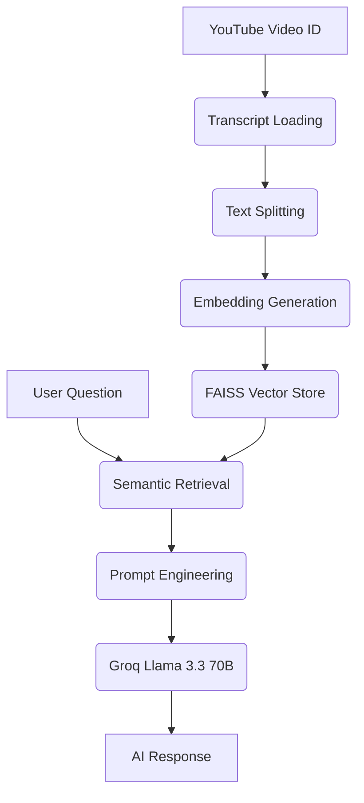

# ▶ YouTube ChatBot — RAG Application

A YouTube Video ChatBot powered by **Retrieval-Augmented Generation (RAG)**. Paste a video ID, get instant summaries, and ask questions about any YouTube video — all through a sleek Streamlit interface.


---

## ✨ Features

| Feature | Description |
|---------|-------------|
| 🎥 **Video Transcript Loading** | Fetches transcripts from any YouTube video using its video ID |
| 🌐 **Multi-Language Support** | Support for **English** and **Hindi** (auto-generated) transcripts |
| 📝 **AI-Powered Summary** | Generates a detailed summary covering main topics and key takeaways |
| 💬 **Q&A Chat** | Ask any question about the video and get contextual answers |
| ⚡ **Ultra-Fast Inference** | Uses Groq's Llama 3.3 70B for lightning-fast responses |
| 🔍 **Semantic Search** | FAISS vector store with similarity retrieval for accurate context |
| 🎨 **Dark Glassmorphism UI** | Modern, premium-looking Streamlit interface with YouTube branding |

---

## 🏗️ Architecture — LangChain Modular RAG

The application follows a modular architecture where each RAG stage is an **isolated, swappable module**:

```
├── components/                  # Core RAG Logic
│   ├── __init__.py
│   ├── document_loader.py       # Stage 1a: YouTube transcript ingestion (Multi-lang)
│   ├── text_splitter.py         # Stage 1b: Text chunking (RecursiveCharacter)
│   ├── embeddings.py            # Stage 1c: Local Embedding model (HuggingFace)
│   ├── vector_store.py          # Stage 1d: FAISS indexing & retriever
│   └── llm.py                   # Stage 4: LLM factory (ChatGroq)
│
├── prompts/                     # Prompt templates
│   ├── __init__.py
│   └── templates.py             # Stage 3: System & RAG prompt definitions
│
├── chains/                      # LCEL chain composition
│   ├── __init__.py
│   └── rag_chain.py             # Stage 2 & 5: LCEL chain composition
│
├── ui/                          # Streamlit UI layer
│   ├── __init__.py
│   └── components.py            # Streamlit UI Custom CSS & Components
│
├── config.py                    # Global Hyperparameters
└── app.py                       # Main Streamlit Entry Point
```

### RAG Pipeline Flow



---

## 🚀 Getting Started

### Prerequisites

- Python 3.10 or higher
- A [Groq API key](https://console.groq.com/keys) (Get it for free)

### Installation

```bash
# 1. Clone the repo
git clone https://github.com/Shubham00117/YouTube-ChatBot-RAG-Application-.git
cd "Youtube ChatBot ( RAG Application)"

# 2. Create a virtual environment (Recommended)
python -m venv venv
source venv/bin/activate  # On Windows: venv\Scripts\activate

# 3. Install dependencies
pip install -r requirements.txt

# 4. Set up Environment Variables
cp .env.example .env
# Open .env and add your key:
# GROQ_API_KEY=gsk_your_actual_key_here
```

### Running the App

```bash
streamlit run app.py
```
The app will open at **http://localhost:8501**

---

## 📖 How to Use

### Step 1 — Load a Video
1. Go to YouTube and copy the **video ID** (e.g., `LPZh9BOjkQs` from `youtube.com/watch?v=LPZh9BOjkQs`).
2. Paste the ID and select the **Transcript Language** (English or Hindi).
3. Click **🔗 Load Video & Build Index**.

### Step 2 — Generate Summary
1. Once loaded, click **✨ Generate Summary**.
2. The AI will provide a structured breakdown of the video content.

### Step 3 — Ask Questions
1. Use the chat input to ask specific questions like *"What are the 3 main takeaways?"*.
2. The bot retrieves relevant context from the transcript to answer accurately.

---

## ⚙️ Configuration

Tune the application behavior in [`config.py`](config.py):

| Constant | Default | Purpose |
|----------|---------|---------|
| `CHUNK_SIZE` | 1000 | Max characters per document chunk |
| `CHUNK_OVERLAP` | 200 | Context preservation between chunks |
| `EMBEDDING_MODEL` | `all-MiniLM-L6-v2` | Local model used for vectorization |
| `LLM_MODEL` | `llama-3.3-70b-versatile` | The brain (Groq model) |
| `LLM_TEMPERATURE` | 0.2 | Determinism vs Creativity |
| `RETRIEVER_K` | 4 | Number of top-match chunks fed to LLM |

---

## �️ Tech Stack

- **Framework**: [LangChain](https://www.langchain.com/) (LCEL)
- **Frontend**: [Streamlit](https://streamlit.io/)
- **LLM**: [Groq](https://groq.com/) (Llama 3.3 70B)
- **Embeddings**: HuggingFace (`sentence-transformers`)
- **Vector Database**: [FAISS](https://github.com/facebookresearch/faiss)
- **Transcript API**: `youtube-transcript-api`

---

## ⚠️ Troubleshooting

- **"Could not fetch transcript"**: This usually happens if the video has disabled captions or doesn't have a transcript in the selected language. Try a video with "CC" (Closed Captions) available.
- **"Invalid API Key"**: Ensure your `GROQ_API_KEY` in `.env` is correct and has no extra spaces.
- **FAISS Errors**: If you encounter issues with `faiss-cpu`, ensure you have the C++ build tools installed on your system or try `pip install faiss-cpu --no-cache-dir`.

---

## 🗺️ Roadmap & Future Enhancements

- [ ] **Multi-Video Context**: Support for asking questions across multiple YouTube videos.
- [ ] **Chat History**: Persistent session state for longer conversations.
- [ ] **Export Options**: Download summary and Q&A as PDF/TXT.
- [ ] **UI Themes**: Support for Light mode and more custom themes.
- [ ] **Advanced RAG**: Implementing Self-RAG or Corrective-RAG for higher accuracy.

---

## 📜 License

Distributed under the MIT License. See `LICENSE` for more information (Educational Project).

---

**Developed with ❤️ by [Shubham](https://github.com/Shubham00117)**
